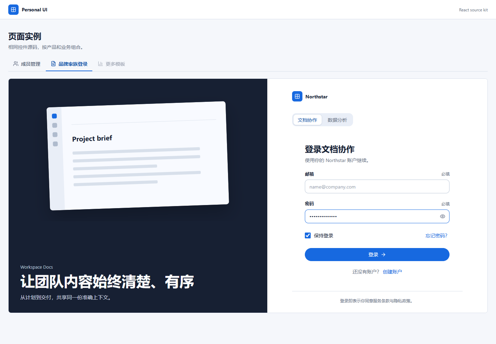
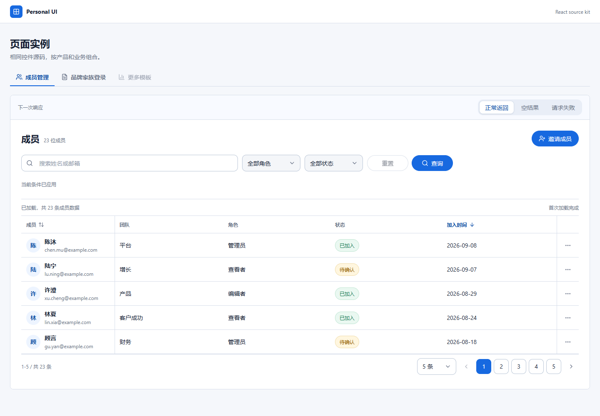

# UI Builder XTN

一个可直接安装和复用源码的 Codex Skill，用于构建风格一致、交互稳定的 React + TypeScript 产品界面。

它不是只靠提示词约定视觉风格：Skill 会把经过验证的 Personal UI 组件源码安装到目标项目，再使用这些组件组合登录、表单、CRUD、搜索列表、数据表格、反馈和弹层页面。





## 主要能力

- React、TypeScript、Vite 与 `lucide-react` 的完整源码组件包
- 统一的按钮、输入、搜索、下拉、标签、日期、分页、Toast、Alert、Dialog、Drawer 和 DataTable
- 品牌家族登录页：共享登录结构，同时允许各产品使用独立插画、名称和强调色
- 服务端数据列表：草稿筛选、手动查询、排序、分页、加载、空状态、错误与重试
- 稳定的异步控件尺寸、表格高度、输入框图标位置和响应式行为
- 适配 320px 至宽屏桌面的组件契约与校验脚本

完整组件说明见 [组件目录](references/component-catalog.md)，接入约束见 [集成指南](references/integration.md)。

## 环境要求

- Codex
- Python 3.10+
- Node.js 18.18+

## 安装为 Codex Skill

PowerShell：

```powershell
git clone https://github.com/xtnkking/ui-builder-xtn.git "$env:USERPROFILE\.codex\skills\ui-builder-xtn"
```

macOS / Linux：

```bash
git clone https://github.com/xtnkking/ui-builder-xtn.git "${CODEX_HOME:-$HOME/.codex}/skills/ui-builder-xtn"
```

重新打开 Codex 任务后即可调用：

```text
$ui-builder-xtn 使用现有组件做一个带筛选、手动查询、分页和右侧抽屉的成员管理页面
```

## 创建新项目

在仓库根目录执行：

```powershell
python scripts/install_personal_ui.py --mode starter --target <destination>
cd <destination>
npm ci
npm run dev
```

## 接入已有项目

先预览将要发生的变更：

```powershell
python scripts/install_personal_ui.py --mode integrate --target <project-root> --force --dry-run
```

确认后安装：

```powershell
python scripts/install_personal_ui.py --mode integrate --target <project-root> --force
```

组件源码会安装到 `src/personal-ui/`。在应用入口引入一次样式：

```tsx
import "./personal-ui/styles.css";
```

然后从统一出口使用组件：

```tsx
import { Button, DataTable, Drawer, SearchInput } from "./personal-ui";
```

## 验证

验证目标项目确实使用了需要的组件，并且安装源码没有漂移：

```powershell
python scripts/verify_personal_ui.py `
  --target <project-root> `
  --require-component SearchInput `
  --require-component Button `
  --require-component DataTable `
  --require-component Drawer
```

验证仓库自带的 React 示例：

```powershell
npm --prefix assets/react-kit ci
npm --prefix assets/react-kit run build
npm --prefix assets/react-kit run dev
```

## 命名说明

Codex Skill 的调用名是 `ui-builder-xtn`。内部组件目录、CSS 命名空间和安装脚本继续使用 `personal-ui`，这是为了保持现有项目兼容，不是遗漏的旧 Skill 名称。

## License

本仓库当前未附加开源许可证。公开可见不代表自动授予复制、修改或再分发权利。
